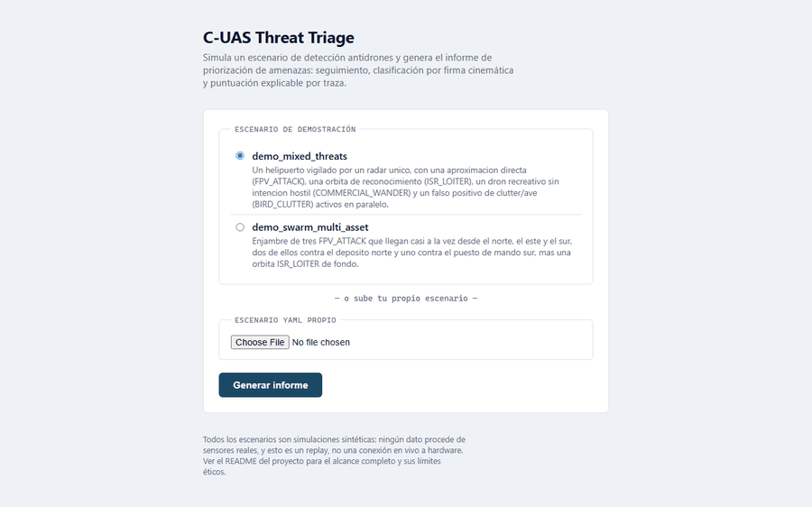

# C-UAS Threat Triage

[Español](README.md) · **English**

[](https://github.com/alberto-navas/cuas-threat-triage/actions/workflows/tests.yml)
[](LICENSE)

**Live demo: [cuas-threat-triage.onrender.com](https://cuas-threat-triage.onrender.com)**
(free tier: if it's been idle for a while, the first load takes ~30-50s)

Decision-support system for counter-UAS (C-UAS) threat prioritization.
Given a simulated scenario, it builds the full pipeline — detection →
tracking → classification → decision — and produces an explainable
response-priority ranking: which track to address first, against which
protected asset, and why.

<p align="center">
  
</p>

## Motivation

An air-defense operator evaluating several simultaneous contacts has to
decide, in seconds, which one to address first. That reasoning — closing
kinematics, contact type, proximity to whatever is being protected — is
exactly the kind of problem that lends itself to an explainable software
layer: it doesn't replace the operator's judgment, it hands it over
already ranked and justified. This project is an exploration of that
decision layer, with 100% synthetic data (no public dataset of fused C-UAS
tracks exists — it's sensitive information in any real operational
system).

## Capabilities

- **Scenario simulation**: protected assets with proximity rings, sensors
  with configurable noise and detection probability, and four threat
  archetypes (direct FPV-style approach, reconnaissance loiter, erratic
  recreational drift, clutter/bird) — `src/simulation/`.
- **Multi-target tracking**: constant-velocity alpha-beta filter +
  nearest-neighbor association with a distance gate + M-of-N confirmation
  (`TENTATIVE → CONFIRMED → COASTING → DROPPED`) — `src/tracking/`.
- **Explainable classification by kinematic signature**: average speed,
  turn rate, and its consistency decide the drone type through a
  documented rule tree, not a black box — `src/classification/`. The
  track never carries any hint of the archetype that generated it: the
  classifier only ever sees what a real system would see.
- **Threat scoring across four independent components**, each auditable
  on its own — `src/scoring/`:
  - *Kinematics*: TCPA/DCPA (time and distance to closest point of
    approach) — the same math used for collision detection in maritime
    navigation and air-traffic control.
  - *Zone*: which proximity ring around the asset the track is currently
    in.
  - *Classification risk*: weighted by confidence — an unreliable
    classification is pulled toward a neutral value, not toward the
    extreme of its class.
  - *Behavior*: sustained heading alignment with the specific asset being
    scored (distinguishes an "attack-shaped" track that's actually headed
    toward a *different* asset).
- **Multi-asset decision**: every track is scored against all protected
  assets and prioritized globally by its highest threat, with the
  asset's declared criticality as an explicit fifth score component —
  `src/decision/`.
- **Self-contained HTML report**: tactical map (local coordinates, not
  geographic — this is a point-defense system, not a street map) +
  priority table + full per-track breakdown justifying every component —
  `src/report/`.
- **CLI** (`src/cli.py`) and **web panel** (`src/web/`, FastAPI) over the
  same shared pipeline (`src/pipeline.py`).

## Architecture

`src/model.py` is the common data model (`Detection`, `Track`,
`ProtectedAsset`, `ThreatScore`...) shared by every stage — the
"vocabulary" that keeps any one stage from needing to know the internals
of the one before it.

```
scenario (YAML: assets + sensors + threats)
        │
        ▼
src/simulation/scenario.py      (loads and validates the scenario)
src/simulation/trajectories.py  ("ground truth" trajectory per archetype)
src/simulation/detections.py    (noisy per-sensor detections)
        │
        ▼
src/tracking/filter.py       (constant-velocity alpha-beta filter)
src/tracking/associator.py   (nearest-neighbor association with a gate)
src/tracking/tracker.py      (M-of-N confirmation)  ──► Track
        │
        ▼
src/classification/kinematic_signature.py  (kinematic-signature rules)  ──► DroneClass
        │
        ▼
src/scoring/kinematics.py           (TCPA/DCPA)
src/scoring/zone.py                 (proximity rings)
src/scoring/classification_risk.py  (risk by type, weighted by confidence)
src/scoring/behavior.py             (sustained heading alignment)
        │
        ▼
src/decision/prioritizer.py   (weighted sum ──► ThreatScore, global ranking)
        │
        ▼
src/report/generator.py  ──► HTML report (tactical map + priority table)
        ▲
        │
src/cli.py            src/web/ (FastAPI)
```

One design detail that ended up documented directly in the code: the
tracker associates simultaneous detections from two sensors on the same
threat greedily (pure nearest-neighbor, not an optimal assignment
algorithm like the Hungarian method), so it can spawn short-lived "ghost"
tracks. That was a deliberate choice — documented as a known limitation
rather than solved with more complexity than this scope warrants (see
`src/tracking/tracker.py`).

## Usage

```bash
# One scenario -> one report
python -m src.cli data/scenarios/demo_mixed_threats.yaml

# Several scenarios -> one report each, in a directory
python -m src.cli data/scenarios/*.yaml --output output/

# Tune the tracker (association gate, confirm/drop thresholds)
python -m src.cli data/scenarios/demo_swarm_multi_asset.yaml --gate-distance-m 100 --confirm-hits 2

# Web panel: pick or upload a scenario, view the report in the browser
python -m src.web
# -> http://127.0.0.1:8000
```

Demo scenarios live in `data/scenarios/`: one with all four threat
archetypes against a single asset, another with a three-drone simultaneous
swarm split across two assets of different criticality.

## Tests

```bash
pytest -v
```

147 tests covering all ten pipeline modules (simulation, tracking,
classification, scoring, decision, report, CLI, web panel), using
synthetic fixtures versioned in `tests/fixtures/` — none of them depend on
downloading anything external. They run automatically on every `push` via
GitHub Actions (`.github/workflows/tests.yml`), on Ubuntu and Windows.

## Code quality

```bash
ruff check .        # lint
ruff format .       # formatting
mypy src/           # static type checking
```

Configured in `pyproject.toml`. Checked automatically on every `push` (a
`lint` job separate from the tests job). `mypy` only ignores the missing
stubs for `plotly` (it doesn't publish types); everything else, including
all first-party code, is checked precisely.

**Test coverage**: 100% (`pytest --cov=src`), with a CI threshold of 85%
as a safety net against a major drop, not as a line-by-line target to
chase.

A real example of why strict coverage matters here: validating
classification against the full pipeline (instead of against the ideal
trajectory) surfaced that sensor noise was leaking into the filtered
velocity enough that a perfectly straight trajectory looked erratic. The
classification thresholds and the filter's `beta` were recalibrated
against real data from the pipeline itself, not blindly — the cause and
the fix are documented in the code (`src/tracking/tracker.py`,
`src/classification/kinematic_signature.py`).

## Test data

All data in this project is synthetic: no public dataset of fused C-UAS
tracks (position + velocity + classification per instant) exists to
validate against, because it's sensitive information in any real
operational system — unlike the sibling project
([Drone Flight Incident Analyzer](https://github.com/alberto-navas/drone-flight-incident-analyzer)),
where real, public flight logs do exist. Each threat archetype's
parameters (speeds, orbit radii, heading volatility) were chosen as
plausible for that profile — an attacking FPV faster than a commercial
drone, a reconnaissance loiter with a radius tight enough for its turn
rate to be detectable — not derived from a specific dataset or
specification.

## What this project deliberately does NOT do

This is the **detection → tracking → classification → decision** layer,
never the neutralization one:

- No interceptor guidance code, RF jamming/inhibition, active GPS
  spoofing, or control of any real effector, kinetic or non-kinetic.
- It doesn't decide or execute any engagement or fire action: the output
  is a prioritized list for human-operator decision support, never an
  autonomous interception order.
- It doesn't process raw real-sensor signal (radar IQ, RF, video): input
  data is synthetic, generated by a scenario simulator that declares
  itself as such in every report.
- Drone-type classification is a heuristic over a simulated kinematic
  signature, not a certified classifier trained on real operational data.
- The web panel is a *replay* of a simulated scenario, not a live
  connection to any hardware.

## Possible extensions

- Coordinated-track correlation (a "swarm group" score bonus) — the
  scenario generator already supports simultaneous multi-asset threats,
  but v1 scoring rates each track independently; see the phasing comment
  in `src/decision/prioritizer.py`.
- An optional ML classifier trained on synthetic kinematic signatures,
  with a per-prediction explanation (which feature weighed the most), as
  an additional layer alongside the current explicit rules — never in
  their place.
- Real terrain (an elevation model) instead of flat ground in the sensor
  range and DCPA calculations.
